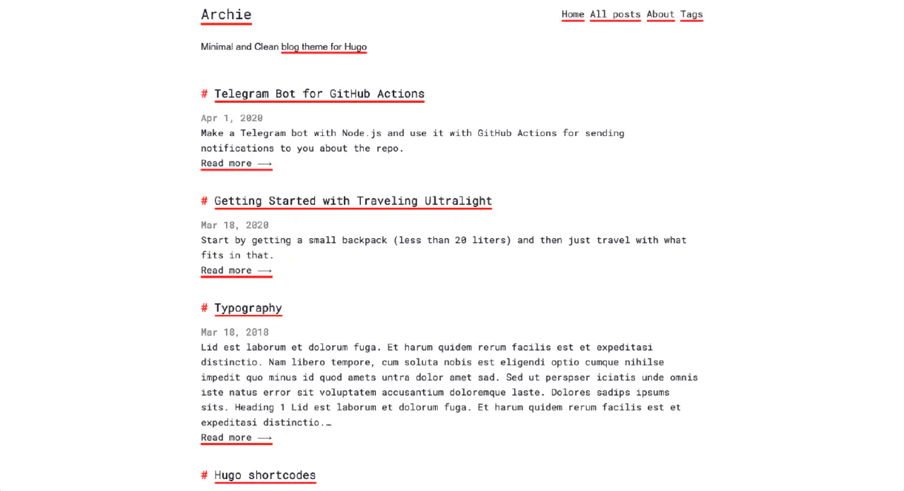
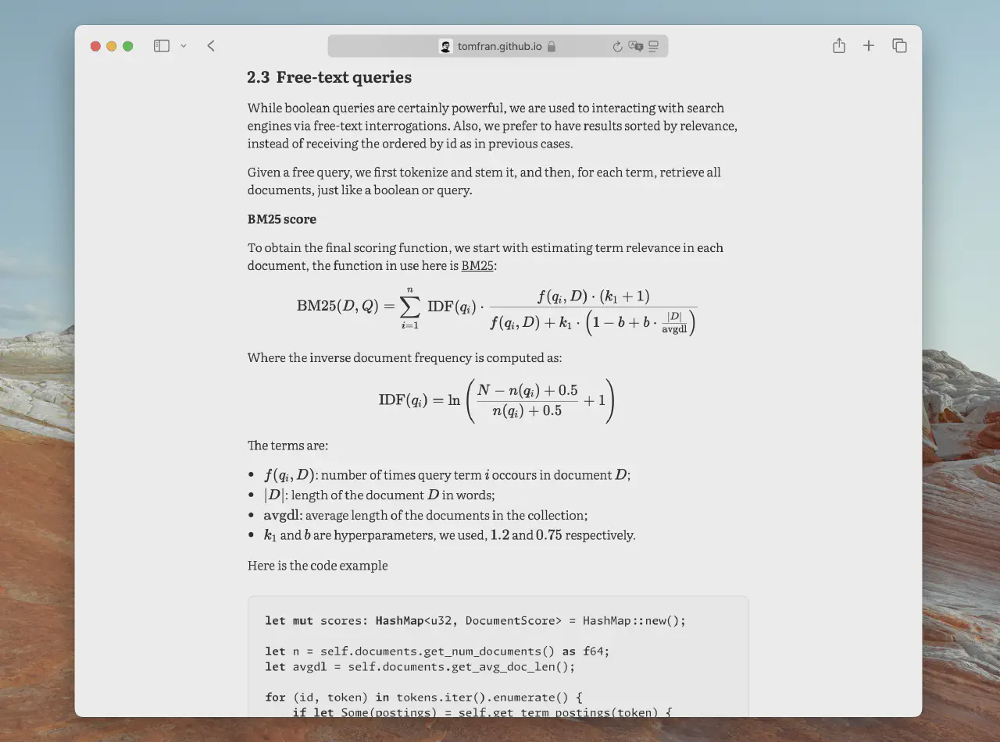
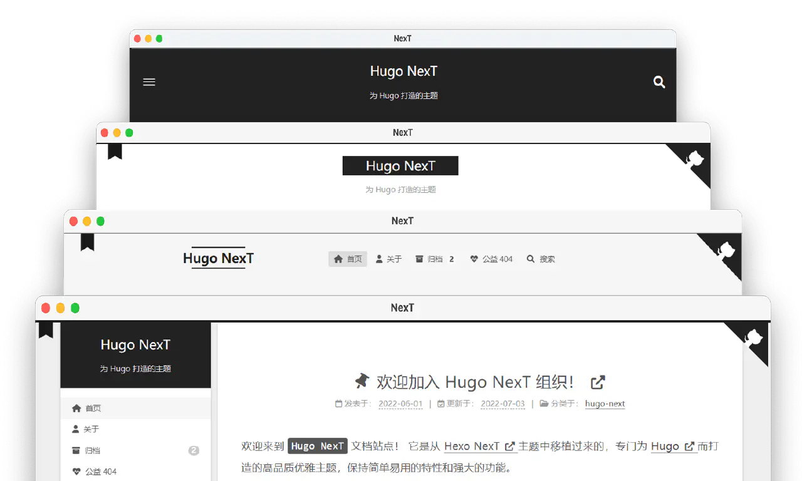
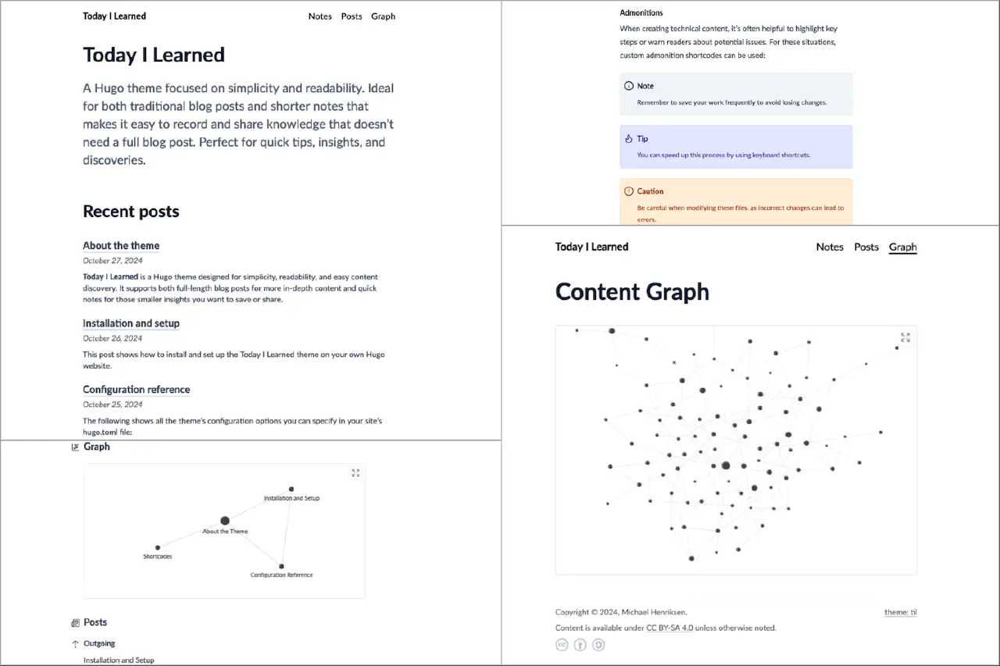
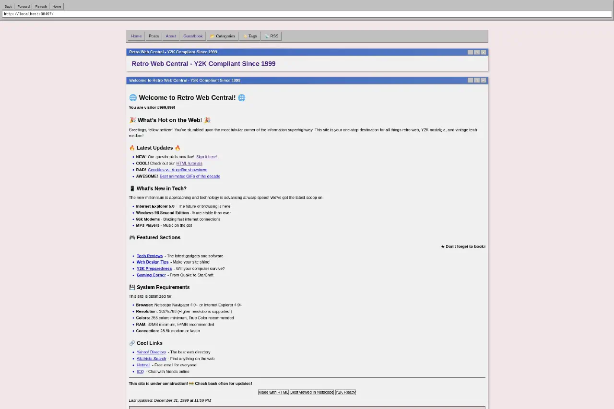
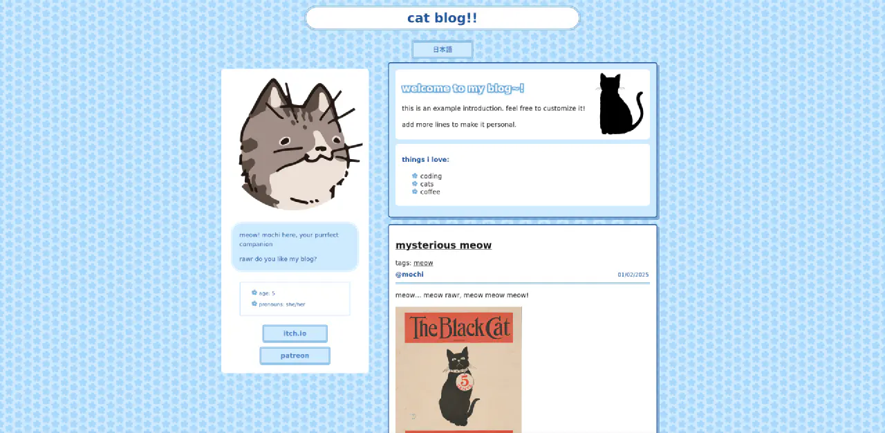

Eu amo escrever. Não quer dizer que eu sei fazer muito bem, mas que eu sempre estou fazendo um pouquinho que seja, seja no papel ou em algum lugar da internet até eu dar um sumiço. Por conta disso, toda vez que eu acho uma ferramenta nova de blogs que me agrada é uma nova tentativa de fazer com que um espaço dure.

Dessa vez, enquanto eu buscava as respostas pra mais algum problema técnico, cheguei em um site muito bem organizado. No final da página, o rodapé dizia **Made with Hugo Apéro**. Cliquei e vi a bio do repositório no Github: _A Hugo theme you'll want to hang out with_. Primeira reação: quem é Hugo, meu Deus?

Chegando na documentação, vi que [Hugo](https://gohugo.io/about/introduction/) é um gerador de páginas estáticas, assim como ferramentas como o Jekyll, que eu já tinha usado anteriormente para criar um blog. Dessa vez, se tratava de uma ferramenta em Go focada em rapidez em sua construção e aberta a personalização. Mas admito que o que me brilhou os olhos foi a galeria de temas de fato possuir temas interessantes para a melhor primeira experiência possível do usuário.

Atualmente, e escrevo isso nos minutos finais do dia 27/07/2025, há centenas de temas disponíveis; e os meus favoritos estão na tag _personal_, dirigidos especialmente ao uso em páginas pessoais, como esse blog onde estamos.

### [hugo-theme-console](https://themes.gohugo.io/themes/hugo-theme-console/)

Esse é o tema que eu escolhi inicialmente para o blog por ser equilibrado entre meu gosto pelo clean e a necessidade de ter uma gracinha, uma firula. Um manifesto diretamente do meu terminal (se bem que meu terminal é bem mais enfeitadinho).

### [Archie](https://themes.gohugo.io/themes/archie/)

É quase o meu, só que menos. Talvez se tivesse essa seção de imagens, venceria.

### [Typo](https://themes.gohugo.io/themes/typo/)

Podre de chique, grandes chances também de virar um titular, mas é bem direto ao ponto, né? Queria enfiar algum frufru nele antes de trazer ao meu prezado público.

### [Hugo NexT](https://preview.hugo-next.eu.org/)

Conteúdo logo de cara, barra lateral, já vai pra um lado bem mais expansivo que os anteriores. Quando já tem o conteúdo de primeira, é mais fácil de a gente customizar do que criar do nada, né?

### [Today I Learned](https://themes.gohugo.io/themes/hugo-theme-til/)

Esse aqui é bem específico, mesmo indo por um caminho parecido ao tema **Typo**. Ele me lembra muito a ideia do Obsidian, com as notas atômicas do método Zettelkasten formando várias conexões entre os conceitos que são tratados. Além dos posts normais, tem a seção de notas, que traz uma proposta de textos mais rápidos que não precisam de um texto extenso. Em situações que pedem, esse tema é incrível!

### [Vintage Web](https://themes.gohugo.io/themes/vintage-web-hugo-theme/)

Olha esse tema, fala sério!!! Ele tem tantos elementos a se apontar, é SUPER bem feito. Tem tanta coisa pra olhar que a gente fica até meio perdido, então o dono da página tem que escolher se vale mais a personalidade que esse tema dá pra página ou a paciência do leitor de navegar por aqui. 😅

### [neopost](https://themes.gohugo.io/themes/neopost/)

E por último mas não menos importante, um tema que como diz na descrição é super neocities, mas pra mim também é super neopets, super Gaia online, eu amei DEMAAAAAAAISSSS! É uma porta aberta pra gente retomar todas as páginas pessoais que tinha nos anos 2000, onde tanta gente aprendeu a mexer com HTML pra ter o perfil mais legal do mundo. Esse aqui me dá é vontade de fazer um inspirado bem do zero, bem com a minha cara e o maior número possível de gifs com glitter e personagens da Sanrio.

Hugo, prometo dessa vez ficar o máximo de tempo que eu lembrar. 🙏🏽
