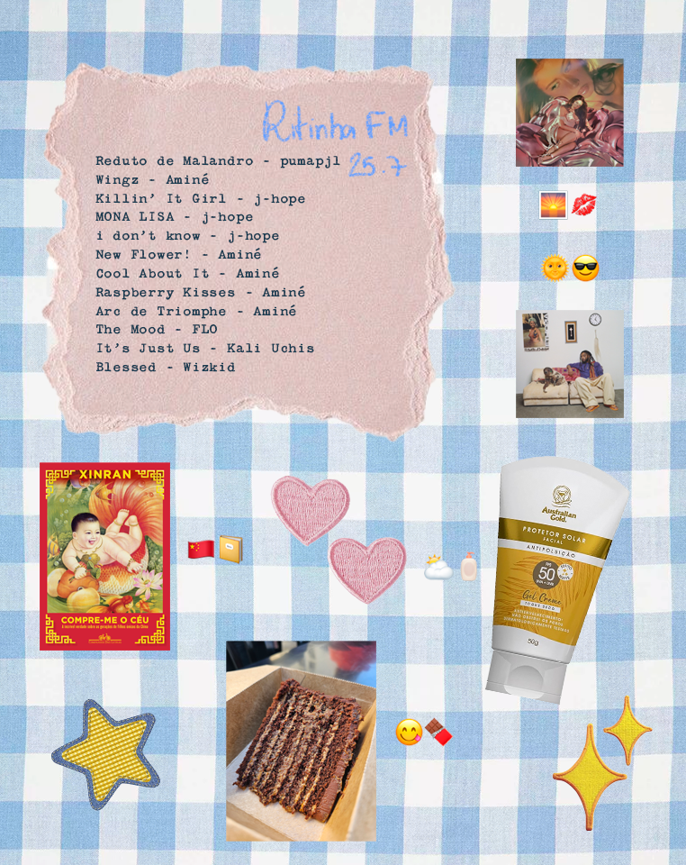

## Playlist do mês

O astro do mês foi o álbum que eu enrolei tanto (pra variar) pra ouvir: [13 Months of Sunshine](https://youtu.be/CzUskXpimLU?si=hkgPF_S_JnQJaH2_). Acho que não existe algum projeto do Aminé que eu não goste, ele é definitivamente um dos artistas que eu gostaria muito de ver ao vivo. Talvez eu até superasse meu ódio de ir a festivais como uma pessoa que não alcançou os 1,60m e não tem acesso a lounges VIP.

Outros itens da lista também são causados por eu acumular lançamentos até eu sentir que estou sob as condições ideias de temperatura e pressão pra ouvir com a atenção que eles merecem, até porque de fato me acontece de ouvir algo pela primeira vez sem muito entusiasmo e achar ok. Daí eu revisito alguns meses depois e fico _MEODEOS EU AMEI..... ONDE ISSO TAVA QUE EU NÃO SABIA_ (eu já sabia e esqueci totalmente 🤠).

Último exemplo relevante: [Eu Ainda Tenho Coração](https://www.youtube.com/playlist?list=PLL2okX4PkPTvFsRsIpivSdH-9uvbR1yOa) do LEALL. Meu namorado é muito fã dele e ele me fez ouvir esse álbum num avião em direção a Buenos Aires, na época do lançamento. Se alguém sabe algo sobre mim, vai saber que eu fico parecendo uma criança que comeu açúcar demais quando estou indo viajar. Então dá pra dizer que meu foco tava em bastante coisa, mas não em apreciar aquele álbum, por mais que eu o ame hoje em dia.

Menção especial pra It's Just Us da Kali Uchis, que representa o _Sincerely,_ nessa lista. É incrível como ela é capaz de entregar álbuns incríveis tão diferentes uns dos outros: já é um pulo vindo do Orquídeas, imagina de álbuns anteriores. Mas nunca devemos duvidar de quem entregou um Isolation. 🙏🏽

## Protetor solar novo!

Minha saga interminável atrás de bons protetores solares faciais encontra mais um concorrente: O **Gel Creme 50FPS** da **Australian Gold** se saiu muito bem! Ao nível mais simples possível, eu tenho dois critérios principais para avaliar um protetor: minha pele vai ficar esbranquiçada? Vou ficar parecendo um pastel oleoso, ou mesmo o Bob Esponja ressecado?

Geralmente, os protetores que eu testo conseguem atender bem a um dos dois, falhando (de forma discreta ou absurda) no outro. Ou se conseguem balancear os dois de forma decente, pecam em quesitos menores porém incômodos, como deixar o olho ardendo.

Esse da Australian Gold deixa um branco muuuuito leve de primeira e depois de alguns segundos fica imperceptível e a pele mantém o viço, mas não fica nada brilhoso. A única mini crítica que eu teria é que ele é um pouco difícil de espalhar, mas é algo que se você fizer mini pontinhos ao longo do rosto já resolve, pra não ter que ficar levando ele pra muito longe.

## Voltei a ler!

Eu sempre gostei muito de ler, mas tem muitos anos que eu não sou consistente com o hábito. Em mais uma tentativa, peguei pra ler **Compre-me o céu: A incrível verdade sobre as gerações de filhos únicos da China**, da Xinran. Não tive muita expectativa ao iniciar, até porque eu só sabia que falava das consequências da política de filho único da China, mais nada.

Gostei muito! É uma coleção de anedotas que deixa a gente coçando a cabeça pensando em um modelo de criação tão diferente (digo levando em conta todo o contexto do país) e as formas múltiplas que os jovens lidam com ele.

Dei aquela fuçadinha no Goodreads depois de terminar e tinha uma galera um pouco decepcionada, dizendo que esperavam algo mais jornalístico no sentido de trazer mais informação. Eu admito que não fui com essa expectativa mas entendo de onde eles trazem esse sentimento: se eu tivesse levado a parte "a incrível verdade" do título mais a sério, também esperaria uma conclusão mais definitiva do que a opinião solta da autora.

No mais, o maior trunfo desse livro foi prender minha atenção o suficiente pra eu superar minha ressaca literária. De lá pra cá, comecei mais dois livros e tentei fazer meu Kindle ser o mais interessante possível. Fiz o jailbreak dele (pensando em fazer um post sobre isso 🤓) e passei a usar o Koreader, que tem uma porção de recursos adicionais que fazem a experiência mais rica. Acho que agora vai, família 🫣

## Fica, vai ter bolo!

E pra terminar com doçura, finalmente tive a chance de ir a uma feira da [Junta Local](https://www.instagram.com/ajuntalocal/?hl=pt)! Fiquei anos querendo ir e nunca dando certo pra estar passeando sem rumo, ir parar no CCBB e tcharam: feira na parte da frente do museu! Tinha venda de cogumelos, cerveja, tinha aquela barraca de comida nigeriana super hypada... e tinha a [Vulpes Doces](https://www.instagram.com/vulpesdoces) com esse bolo INACREDITÁVEL de 16 camadas. Eu nem sou muito do doce, e o conceito desse bolo deveria me afastar. Mas ele tava tão bonito que eu pedi um sem medo. E nossa... Jesus amado!!!!! Sério, que delícia. É chocolate e doce de leite, mas o chocolate é amarguinho e quebra o que deveria ser enjoado, a ganache também é inacreditável...... comeria um inteiro sem olhar pra trás, tô nem aí. Já virou meu desejo pro meu aniversário.
